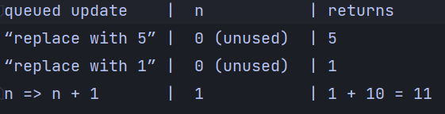

# React Notes

## Table of Contents
1. [Asynchronous state updates](#asynchronous-state-updates)
2. [Handling Events](#handling-events)
3. [List and Keys](#lists-and-keys)
4. [Forms](#forms)
5. [Writing markup with JSX](#writing-markup-with-jsx)
6. [Conditional Rendering](#conditional-rendering)
7. [Using Hooks](#using-hooks)
8. [lifting state up](#lifting-state-up)
9. [React 18 Concepts](#react-18-concepts)

## Asynchronous state updates

React may batch multiple setState() calls into a single update for performance.

Because this.props and this.state may be updated asynchronously, you should not rely on their values for calculating the next state.

```js
// Wrong
this.setState({
  counter: this.state.counter + this.props.increment,
});
```

### Other form of setState using previousState
In this a function is passed in setState rather than an object which contains the previous state and props
```js
// Correct
this.setState((state, props) => ({
  counter: state.counter + props.increment
}));
```

---
### <u>Note</u>
Neither parent nor child components can know if a certain component is stateful or stateless, and they shouldn’t care whether it is defined as a function or a class. 
This is why state is often called local or encapsulated. It is not accessible to any component other than the one that owns and sets it.

---
## Handling Events
- React events are named using camelCase, rather than lowercase.
- With JSX you pass a function as the event handler, rather than a string.

```html
// html
<button onclick="activateLasers()">
  Activate Lasers
</button>
```

```jsx
// react
<button onClick={activateLasers}>
  Activate Lasers
</button>
```

- Another difference is that you cannot return false to prevent default behavior in React. You must call preventDefault explicitly. For example, with plain HTML, to prevent the default form behavior of submitting, you can write:

```html
// html
<form onsubmit="console.log('You clicked submit.'); return false">
  <button type="submit">Submit</button>
</form>
```

- In class based components we cannot just call `this.handleClick()` we have to bind the this to the current class using `bind` method, or there are two alternatives, but generally binding is recommended for performance issues:

- bind like this in constructor -> `this.handleClick = this.handleClick.bind(this);`

1. pass without parenthesis
```jsx
<button onClick={this.handleClick}>
  Click me
</button>
```

2. use arrow function

```jsx
<button onClick={() => this.handleClick()}>
  Click me
</button>
```

### Passing arguments to event handlers
```jsx
// arrow function - explicit 'e' passing

<button onClick={(e) => this.deleteRow(id, e)}>Delete Row</button>

// bind method - implicit 'e' passed

<button onClick={this.deleteRow.bind(this, id)}>Delete Row</button>
```

### Preventing Component from Rendering
When we want component to hide itself even though it was rendered by another component. To do this return null instead of its render output.

```jsx
function WarningBanner(props) {
  // this will prevent component to render
  if (!props.warn) {
    return null;
  }

  return (
    <div className="warning">
      Warning!
    </div>
  );
}
```

---
## Lists and Keys
Keys help React identify which items have changed, are added, or are removed. Keys should be given to the elements inside the array to give the elements a stable identity

Ids of objects are best suited as keys but when you don’t have stable IDs for rendered items, you may use the item index as a key as a last resort:
```jsx
const todoItems = todos.map((todo, index) =>
  // Only do this if items have no stable IDs
  <li key={index}>
    {todo.text}
  </li>
);
```

We don’t recommend using indexes for keys if the order of items may change. This can negatively impact performance and may cause issues with component state.

- `index` should not be used as if an element is deleted or added index for elements change and so they are not having unique identifier.
- A good rule of thumb is that elements inside the map() call need keys.


--- 
## Forms

### Handling Multiple Inputs
When you need to handle multiple controlled input elements, you can add a name attribute to each element and let the handler function choose what to do based on the value of event.target.name.


```
handleInputChange(event) {
    const target = event.target;
    const value = target.type === 'checkbox' ? target.checked : target.value;
    const name = target.name;

    this.setState({
      [name]: value
    });
  }
```

### Writing markup with JSX

JSX is stricter than HTML. You have to close tags like <br />. Your component also can’t return multiple JSX tags. You have to wrap them into a shared parent, like a <div>...</div> or an empty <>...</> wrapper:

**Pointers**

- `className` instead of `class` because `class` is a reserved keyword and was used for defining class based components in react.
- `htmlFor` instead of `for` because `for` is a reserved keyword and was used for defining loops in javascript.
- `JSX` lets you put markup into JavaScript. **Curly braces** let you `“escape back”` into JavaScript so that you can embed some variable from your code and display it to the user.
- `style={{}}` is not a special syntax, but a regular `{}` object inside the `style={ }` JSX curly braces.
- `style` is a JavaScript object, not a string. This is why we use camelCase property naming convention (e.g. `backgroundColor` rather than `background-color`).
- `style` is a JavaScript object, so you can pass a JavaScript variable to it, if you want to dynamically change some styles.

### Conditional Rendering

Using conventional `if` statements:

```jsx
let content;
if (isLoggedIn) {
  content = <AdminPanel />;
} else {
  content = <LoginForm />;
}
return (
  <div>
    {content}
  </div>
);
```

Using ternary operator:

```jsx
return (
  <div>
    {isLoggedIn ? <AdminPanel /> : <LoginForm />}
  </div>
);
```

Using `&&` operator for only one condition:

```jsx
return (
  <div>
    {isLoggedIn && <AdminPanel />}
  </div>
);
```

### Using Hooks 

- Hooks are a new addition in React 16.8. They let you use state and other React features without writing a class.
- Hooks are more restrictive than other functions. You can only call Hooks at the top of your components (or other Hooks). If you want to use useState in a condition or a loop, extract a new component and put it there.

- Hooks are JavaScript functions, but they impose two additional rules:
  - Only call Hooks at the top level. Don’t call Hooks inside loops, conditions, or nested functions.
  - Hooks are named with the prefix `use`, like `useState` and `useEffect`. This is a convention that helps with readability.
  - Hooks are functions that let you “hook into” React state and lifecycle features from function components. Hooks don’t work inside classes — they let you use React without classes.

### lifting state up
- Lifting state up means that we want to move the state from child component to parent component so that both can access it.

```jsx
export default function MyApp() {
  const [count, setCount] = useState(0);

  function handleClick() {
    setCount(count + 1);
  }

  return (
    <div>
      <h1>Counters that update separately</h1>
      <MyButton />
      <MyButton />
    </div>
  );
}

function MyButton() {
  // ... we're moving code from here ...
}
```
  
========================================================


# React 18 Concepts

List of concepts
1. [State Explained](#state-explained)
2. [Multiple state variables](#multiple-state-variables)
3. [When a regular function is not enough](#when-a-regular-function-is-not-enough)
4. [useState Hook](#usestate-hook)
5. [Render and Commit](#render-and-commit)
6. [Looking state as a snapshot](#looking-state-as-a-snapshot-in-time)
7. [State Updates (Important)](#state-updates)

## State Explained

- State is a JavaScript object that stores a component’s dynamic data and determines the component’s behavior. State is similar to props, but it is private and fully controlled by the component.
- State is asynchronous, so you can’t rely on its value for calculating the next state. For example, this code may fail to update the counter:

```jsx
const buttonClicked = () => {
  console.log('count prev', count)
  setCount(count + 1)
  console.log('count after', count)
}
```

this button click will log same value of before and after because setCount is asynchronous and it will not update the value of count immediately. So to fix this we can use callback function as an argument to setCount.

### Multiple state variables

- It is a good idea to have multiple state variables if their state is unrelated, like index and showMore in this example. But if you find that you often change two state variables together, it might be easier to combine them into one. For example, if you have a form with many fields, it’s more convenient to have a single state variable that holds an object than state variable per field.
- if there is a need to have multiple state variables then we can use `useState` multiple times but it is not recommended because it will make the code messy and hard to read. So we can use `useReducer` hook to manage multiple state variables which are closely related.

```jsx
const reducer = (state, action) => {
  switch (action.type) {
    case 'SET_NAME':
      return { ...state, name: action.payload }
    case 'SET_AGE':
      return { ...state, age: action.payload }
    case 'SET_EMAIL':
      return { ...state, email: action.payload }
    default:
      return state
  }
}

const [state, dispatch] = useReducer(reducer, {
  name: 'John',
  age: 30,
  email: 'test@test.com'
})
```

```jsx
// use dispatch to update state
<button onClick={() => dispatch({ type: 'SET_NAME', payload: 'Jane' })}>Set Name</button>
```

### When a regular variable isn’t enough 
```jsx
import { sculptureList } from './data.js';

export default function Gallery() {
  let index = 0;

  function handleClick() {
    index = index + 1;
  }

  let sculpture = sculptureList[index];
  return (
    ...
```

<br />
The handleClick event handler is updating a local variable, index. But two things prevent that change from being visible:

1. **Local variables don’t persist between renders**. When React renders this component a second time, it renders it from scratch—it doesn’t consider any changes to the local variables.
2. **Changes to local variables won’t trigger renders**. React doesn’t realize it needs to render the component again with the new data.
To update a component with new data, two things need to happen:

- **Retain the data between renders.**
- **Trigger React to render the component with new data (re-rendering).**

The useState Hook provides those two things:

- **A state variable to retain the data between renders.**
- **A state setter function to update the variable and trigger React to render the component again.**


### `useState` Hook

The only argument to useState is the **initial value** of your state variable. In this example, the index’s initial value is set to 0 with useState(0).

Every time your component renders, useState gives you an array containing two values:

* The state variable (index) with the value you stored.
* The state setter function (setIndex) which can update the state variable and trigger React to render the component again.

###### How does React know which state to return? 

Internally, React holds an array of state pairs for every component. It also maintains the current pair index, which is set to 0 before rendering. Each time you call useState, React gives you the next state pair and increments the index.

[//]: # (To be looked again)
```jsx
let componentHooks = [];
let currentHookIndex = 0;

// How useState works inside React (simplified).
function useState(initialState) {
  let pair = componentHooks[currentHookIndex];
  if (pair) {
    // This is not the first render,
    // so the state pair already exists.
    // Return it and prepare for next Hook call.
    currentHookIndex++;
    return pair;
  }

  // This is the first time we're rendering,
  // so create a state pair and store it.
  pair = [initialState, setState];

  function setState(nextState) {
    // When the user requests a state change,
    // put the new value into the pair.
    pair[0] = nextState;
    updateDOM();
  }

  // Store the pair for future renders
  // and prepare for the next Hook call.
  componentHooks[currentHookIndex] = pair;
  currentHookIndex++;
  return pair;
}
```


### Render and Commit

This process of requesting and serving UI has three steps:
1. Triggering a render (delivering the guest’s order to the kitchen)
2. Rendering the component (preparing the order in the kitchen)
3. Committing to the DOM (placing the order on the table)


Step 1: Trigger a render
There are two reasons for a component to render:

1. It’s the component’s initial render.
2. The component’s (or one of its ancestors’) state has been updated.

Step 2: React renders your components
After you trigger a render, React calls your components to figure out what to display on screen. “Rendering” is React calling your components.

1. On initial render, React will call the root component.
2. For subsequent renders, React will call the function component whose state update triggered the render.

Step 3: React commits changes to the DOM
After rendering (calling) your components, React will modify the DOM.

1. For the initial render, React will use the appendChild() DOM API to put all the DOM nodes it has created on screen.
2. For re-renders, React will apply the minimal necessary operations (calculated while rendering!) to make the DOM match the latest rendering output.

React only changes the DOM nodes if there’s a difference between renders

- After rendering is done and React updated the DOM, the browser will repaint the screen. Although this process is known as “browser rendering”, we’ll refer to it as “painting” to avoid confusion throughout the docs.

### Looking state as a snapshot in time

- “Rendering” means that React is calling your component, which is a function. The JSX you return from that function is like a snapshot of the UI in time. Its props, event handlers, and local variables were all calculated using its state at the time of the render.

- Unlike a photograph or a movie frame, the UI “snapshot” you return is interactive. It includes logic like event handlers that specify what happens in response to inputs. React updates the screen to match this snapshot and connects the event handlers.

- State is a components memory and does not disappear after function returns. It is preserved between renders.
- When React calls your component, it gives you a snapshot of the state for that particular render. Your component returns a snapshot of the UI with a fresh set of props and event handlers in its JSX, all calculated using the state values from that render!


Notice that number only increments once per click!


This also indicates one more important thing: setState methods are asynchronous and batched. This means that if you call setState multiple times in a single render, React will batch the updates together and only re-render once.

**IMPORTANT**

A state variable’s value never changes within a render. Its value was “fixed” when React “took the snapshot” of the UI by calling your component. If you want to update the state variable, you need to call setState.
React keeps the state values “fixed” within one render’s event handlers. You don’t need to worry whether the state has changed while the code is running.

```jsx
<button onClick={() => {
  setNumber(number + 5);
  setTimeout(() => {
    alert(number);
  }, 3000);
}}>+5</button>
```

Alert will show 0 because the state is not updated yet. It will be updated after the render is committed to the DOM.
even if its event handler’s code is asynchronous, the state value is still “fixed” within that render.


## State Updates

Setting a state variable will queue another render. But sometimes you might want to perform multiple operations on the value before queueing the next render. To do this, it helps to understand how React batches state updates.

```jsx
<button onClick={() => {
  setNumber(number + 1);
  setNumber(number + 1);
  setNumber(number + 1);
}}>+3</button>
```

React batches state updates and  each render’s state values are fixed, so the value of number inside the first render’s event handler is always 0, no matter how many times you call setNumber(1):

React waits until all code in the event handlers has run before processing your state updates. This is why the re-render only happens after all these setNumber() calls.

This might remind you of a waiter taking an order at the restaurant. A waiter doesn’t run to the kitchen at the mention of your first dish! Instead, they let you finish your order, let you make changes to it, and even take orders from other people at the table.

This lets you update multiple state variables—even from multiple components—without triggering too many re-renders. 

**Note**

**React does not batch across multiple intentional events like clicks**—each click is handled separately. Rest assured that React only does batching when it’s generally safe to do. This ensures that, for example, if the first button click disables a form, the second click would not submit it again.

### Updating the same state multiple times before the next render

It is an uncommon use case, but if you would like to update the same state variable multiple times before the next render, instead of passing the next state value like setNumber(number + 1), you can pass a function that calculates the next state based on the previous one in the queue, like setNumber(n => n + 1). It is a way to tell React to “do something with the state value” instead of just replacing it.

```jsx
<button onClick={() => {
  setNumber(n => n + 1);
  setNumber(n => n + 1);
  setNumber(n => n + 1);
}}>+3</button>
```

This updates the number value by 3 after re-rendering, instead of 1 as it was in previous case where it was just replacing the value with the given one.

Here, `n => n + 1` is called an updater function. When you pass it to a state setter:

1. React queues this function to be processed after all the other code in the event handler has run.
2. During the next render, React goes through the queue and gives you the final updated state.

When you call `useState` during the next render, React goes through the queue. The previous number state was 0, so that’s what React passes to the first updater function as the n argument. Then React takes the return value of your previous updater function and passes it to the next updater as n, and so on:

### What happens if you update state after replacing it 

```jsx
<button onClick={() => {
  setNumber(number + 5);
  setNumber(number + 1);
  setNumber(n => n + 10);
}}>Increase the number</button>
```



This is very important to understand that just using `number`, react was computing the value and will replace the value in next render.

However, if updater function is used, it will consider the last updated value and will compute the next value based on that.

